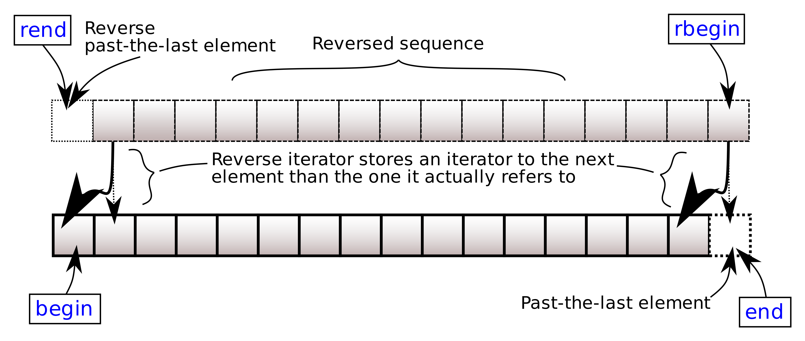

# `fixstr::basic_fixed_string::rbegin` <br/> `fixstr::basic_fixed_string::crbegin`

import Overload1 from '!!raw-loader!.//rbegin/1.cpp';
import Overload2 from '!!raw-loader!.//rbegin/2.cpp';
import Overload3 from '!!raw-loader!.//rbegin/3.cpp';
import Example from '!!raw-loader!.//rbegin/example.cpp';
import CppOverload from '../../components/CppOverload';
import CppOverloadList from '../../components/CppOverloadList';
import LinkButton from '../../components/LinkButton';
import CodeBlock from '@theme/CodeBlock';

<CppOverloadList>
    <CppOverload num={1} code={Overload1} />
    <CppOverload num={2} code={Overload2} />
    <CppOverload num={3} code={Overload3} />
</CppOverloadList>

Returns a reverse iterator to the first character of the reversed fixed string. 
It corresponds to the last character of the non-reversed fixed string.



## Parameters

(none)

## Return value

Reverse iterator to the first character.

## Complexity

Constant.

## Example

<LinkButton link="https://godbolt.org/z/MWd1Wvfsx">Run this code!</LinkButton>
<CodeBlock className="language-cpp">{Example}</CodeBlock>
Output:

```
Exemplary
yralpmexE
```
