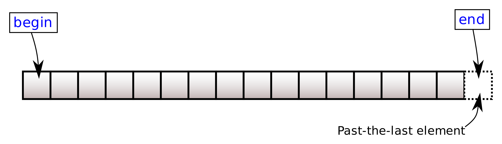

# `fixstr::basic_fixed_string::begin` <br/> `fixstr::basic_fixed_string::cbegin`

import Overload1 from '!!raw-loader!.//begin/1.cpp';
import Overload2 from '!!raw-loader!.//begin/2.cpp';
import Overload3 from '!!raw-loader!.//begin/3.cpp';
import Example from '!!raw-loader!.//begin/example.cpp';
import CppOverload from '../../components/CppOverload';
import CppOverloadList from '../../components/CppOverloadList';
import LinkButton from '../../components/LinkButton';
import CodeBlock from '@theme/CodeBlock';

<CppOverloadList>
    <CppOverload num={1} code={Overload1} />
    <CppOverload num={2} code={Overload2} />
    <CppOverload num={3} code={Overload3} />
</CppOverloadList>

Returns an iterator to the first character of the fixed string.

`begin()` returns a *mutable* or *constant* iterator, depending on the constness of `*this`.

`cbegin()` always returns a *constant* iterator. It is equivalent to `std::as_const(*this).begin()`



## Parameters

(none)

## Return value

Iterator to the first character.

## Complexity

Constant.

## Example

<LinkButton link="https://godbolt.org/z/9PWsxqK6h">Run this code!</LinkButton>
<CodeBlock className="language-cpp">{Example}</CodeBlock>
Output:

```
exemplar
e
e
```
