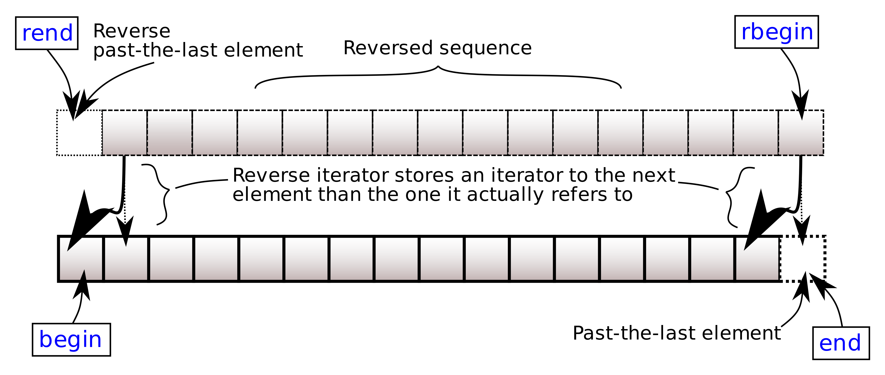

# `fixstr::basic_fixed_string::rend` <br/> `fixstr::basic_fixed_string::crend`

import Overload1 from '!!raw-loader!.//rend/1.cpp';
import Overload2 from '!!raw-loader!.//rend/2.cpp';
import Overload3 from '!!raw-loader!.//rend/3.cpp';
import Example from '!!raw-loader!.//rend/example.cpp';
import CppOverload from '../../components/CppOverload';
import CppOverloadList from '../../components/CppOverloadList';
import LinkButton from '../../components/LinkButton';
import CodeBlock from '@theme/CodeBlock';

<CppOverloadList>
    <CppOverload num={1} code={Overload1} />
    <CppOverload num={2} code={Overload2} />
    <CppOverload num={3} code={Overload3} />
</CppOverloadList>

Returns a reverse iterator to the character following the last character of the reversed fixed string. 
It corresponds to the character preceding the first character of the non-reversed fixed string. 
This character acts as a placeholder, attempting to access it results in undefined behavior.



## Parameters

(none)

## Return value

Iterator to the character following the last character.

## Complexity

Constant.

## Example

<LinkButton link="https://godbolt.org/z/vMG5h3P3c">Run this code!</LinkButton>
<CodeBlock className="language-cpp">{Example}</CodeBlock>
Output:

```
amanaP :lanac a ,nalp a ,nam A
amanaP :lanac a ,nalp a ,nam A
```
